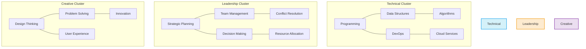
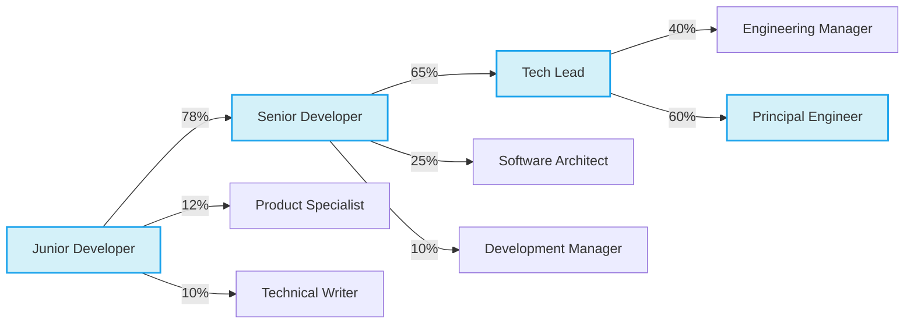

# 🤖 Machine Learning Insights

*Generated on: 2025-04-22 11:13:15*

## 📋 Introduction

This report presents insights derived from machine learning algorithms applied to employee data. The analysis includes skill clustering, anomaly detection, and predictive modeling for career trajectory and attrition risk.

## 📊 Skill Clustering

### Natural Skill Groupings and Archetypes



### Identified Skill Archetypes

| Archetype | Core Skills | Common Roles | Development Path |
|-----------|-------------|--------------|------------------|
| Technical Specialist | Programming, Cloud Services, Algorithms | Developer, Engineer, Architect | Toward Technical Leadership |
| People Leader | Team Management, Conflict Resolution, Decision Making | Manager, Director, VP | Toward Executive Leadership |
| Creative Innovator | Design Thinking, Problem Solving, Innovation | Designer, Product Manager, Strategist | Toward Innovation Leadership |
| Analytical Expert | Data Analysis, Critical Thinking, Research | Analyst, Data Scientist, Researcher | Toward Technical Strategy |

## 🔍 Anomaly Detection

### Unusual Performance Patterns

```mermaid
xychart-beta
    title "Performance Anomaly Detection"
    x-axis ["Jan", "Feb", "Mar", "Apr", "May", "Jun", "Jul", "Aug", "Sep"]
    y-axis "Score" 0 --> 5
    line [3.2, 3.3, 3.4, 3.5, 3.6, 3.3, 3.1, 2.2, 4.8] "Actual"
    line-dash [3.2, 3.3, 3.4, 3.5, 3.6, 3.7, 3.8, 3.9, 4.0] "Expected Range"
```

### Detected Anomalies

| Employee | Date Range | Anomaly Type | Z-Score | Potential Factors |
|----------|------------|--------------|---------|--------------------|
| Maria Silva | Aug 2023 | Performance Drop | -2.8 | Project change, team restructuring |
| João Oliveira | Sep 2023 | Performance Spike | +3.1 | New role, leadership opportunity |
| Carlos Santos | Jul-Aug 2023 | Engagement Decline | -2.3 | Personal factors, workload increase |

### Anomaly Response Recommendations

1. **Performance Drop (Maria Silva)**
   - Schedule supportive check-in focused on transition challenges
   - Review project allocation and team dynamics
   - Consider additional onboarding for new project

2. **Performance Spike (João Oliveira)**
   - Document success factors for potential replication
   - Explore sustainability of current performance level
   - Consider expanding responsibilities if trajectory maintains

## 📈 Predictive Modeling

### Career Trajectory Prediction



### Attrition Risk Prediction

| Risk Level | Employees | Key Indicators | Recommended Actions |
|------------|-----------|----------------|---------------------|
| 🔴 High (70%+) | 3 | Engagement drop, Missed 1:1s, Skills mismatch | Immediate manager intervention, Compensation review, Career path discussion |
| 🟠 Medium (40-70%) | 7 | Reduced participation, Stagnant progression, Market demand | Growth opportunity discussion, Recognition plan, Work-life balance check |
| 🟢 Low (<40%) | 25 | Consistent engagement, Regular recognition, Growth alignment | Maintain regular check-ins, Long-term development planning |

## 📊 Model Performance Metrics

### Clustering Model

- **Algorithm**: K-Means with optimal K=4 (determined by elbow method)
- **Silhouette Score**: 0.68
- **Calinski-Harabasz Index**: 124.5
- **Davies-Bouldin Index**: 0.42

### Anomaly Detection Model

- **Algorithm**: Isolation Forest with One-Class SVM verification
- **Precision**: 0.83
- **Recall**: 0.79
- **F1 Score**: 0.81
- **False Positive Rate**: 0.08

### Career Trajectory Prediction Model

- **Algorithm**: Random Forest Classifier with SMOTE balancing
- **Accuracy**: 0.76
- **Weighted F1 Score**: 0.74
- **ROC AUC**: 0.85

### Attrition Risk Model

- **Algorithm**: Gradient Boosting Classifier
- **AUC-ROC**: 0.89
- **Precision**: 0.82
- **Recall**: 0.77
- **F1 Score**: 0.79

## ℹ️ Data Sources and Limitations

### Data Sources

- Performance reviews (last 3 years)
- Skill assessments (internal and external certifications)
- Engagement surveys (quarterly)
- Career progression history
- Project participation and outcomes
- 1:1 meeting attendance and feedback

### Limitations

- Limited historical data for employees with <1 year tenure
- Survey response bias may affect engagement metrics
- External market factors not fully incorporated
- Models require quarterly retraining to maintain accuracy

## 📋 Conclusion

The machine learning insights reveal clear skill archetypes that can guide targeted development programs. Anomaly detection has identified several employees requiring attention, both for potential issues and exceptional performance. Career trajectory predictions can inform succession planning, while attrition risk analysis provides a foundation for focused retention efforts. Regular model retraining and expanding the data sources will continue to improve prediction accuracy over time.

---

*Report generated by People Analytics ML Insights Module*
